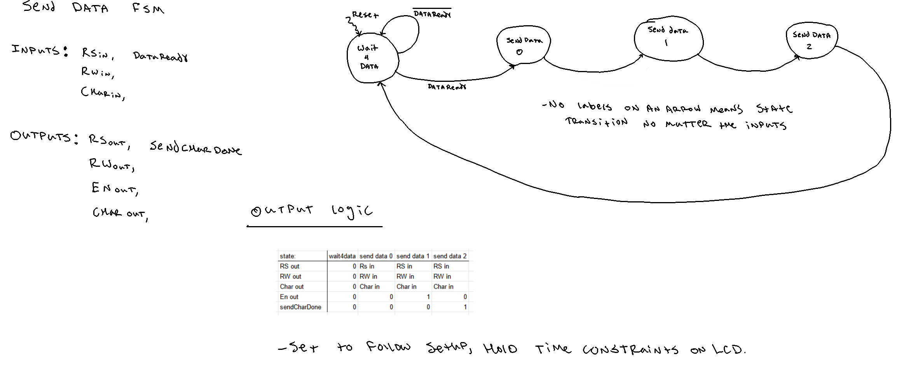
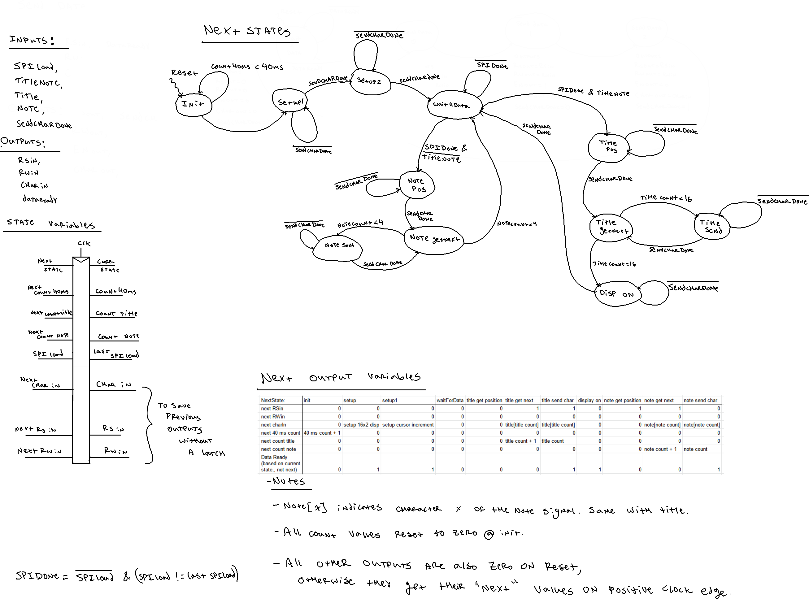

# Microcontroller Design

The MCU was used to control the stepper motor that moved  the slide whistle to play different notes. The block diagram for the wiring of the MCU with the A4988 stepper motor driver and the stepper motor itself is shown in the documentation section. The MCU provides two main control signals to the stepper motor driver: the direction and steps. The direction pin is either high or low to indicate direction, and for each pulse sent to the step pin the motor moves one step. In order to send a known number of pulses at a certain rate, we use the timer 16 peripheral in one-shot PWM mode together with the repetition counter set to the desired number of pulses. This is shown in the code in /src.

# FPGA Design

As mentioned above, the FPGA is capable of displaying characters on the LCD. It is set up using the schematic shown in figure 1. The LCD in this case uses a Hitachi HD44780U LCD controller chip. The FPGA was implemented in a way that could mimic what was described in this controller’s datasheet [ [1](https://circuitdigest.com/sites/default/files/HD44780U.pdf)]. This involved creating several finite state machines. 

  
  
Figure T: Top level diagram of each part of the FPGA design

The first FSM, shown below, used to send data to the screen, works as follows: it waits for data to come in from the controller FSM, indicated by a dataReady signal rising to 1. Then it goes through the steps to send the inputs of the correct RS, R/W, Data, and Enable signals to the LCD controller. Once it is done, it raises a 'sendCharDone' signal back to the controller FSM to indicate that the transaction is complete and a new one can be made. This FSM then sits in a wait state again until the controller sends more data.

  
  
Figure T: FSM for sending data to LCD controller

The controller FSM is rather more complicated, as it has to decide the setup signals being sent to the LCD and time all the data correctly. Its diagram is shown below. It begins in an initial state, where it waits until a counter has gone past a value corresponding to 40ms. This is due to a 40ms startup time described by the LCD controller [ [1](https://circuitdigest.com/sites/default/files/HD44780U.pdf)]. Then, this controller FSM sends two setup signals to the LCD to set the correct configuration registers in the LCD. These set up the LCD as having 16 lines of 2 characters and to incriment the cursor each time a character is written. Then the controller FSM goes into a wait state until it receives data from the MCU over SPI. When the SPI transaction is done, the controller sends a control signal to the LCD that puts the cursor in the correct position for either the title or the note. Finally, the control FSM sends all the title or note characters to the LCD. Once all the characters are sent, the control FSM goes back to the wait state to await the next chunk of data from the MCU. This entire operation relies on several counter variables that count the number of characters sent or the time passed. Each time a character is sent to the LCD, the character sender FSM is activated and the controller FSM remains in the same state until the transaction is complete. This is true for both control character signals and data characters being displayed on the screen. 

  
  
Figure T: FSM for controlling which data and control signals are sent to the LCD

The FPGA receives the correct data to display on the screen via an SPI transaction with the MCU as controller and FPGA as peripheral. Data only needs to go from controller to peripheral, so the CIPO line is ignored. The SPI reception module in the FPGA listens for transactions using an spiLoad signal from the MCU. Another signal, titleNote, is used to indicate whether the transaction is sending new title data or new note data. The FPGA detects when the spiLoad signal has dropped as an indication that data transfer is done and the title or note are ready to send to the screen. 

One issue with this is that the clock for the controller and datasend FSMs must be fairly slow. This is due to the fact that most of the commands to the screen take 37 μs [ [1](https://circuitdigest.com/sites/default/files/HD44780U.pdf) ]. This slow clock was divided down from a 48M MHz fast clock. The problem with this is that the spiLoad signal may rise and fall within less than a slow clock cycle, which means it would not be detected on the rising edge of the clock. To remedy this, a third synchronizing FSM was created and is shown below. This one used the fast 48 MHz to make sure the spiLoad signal was captured. Then, since the ratio of fast and slow clock frequencies was known, this FSM was used to hold an spiDone outut signal until it could be detected by the slow clock. The data from the SPI transaction is held after it is done and the transactions come every several hundred ms, so there is no need to synchronize that data. In this way, all the information coming out of SPI is synchronized to the slower clock of the other FSMs. 

  
  
Figure T: FSM for synchronizing data coming in from SPI to the slower clock domain

# Hardware Design

The slide whistle has a 3D printed attachment from the fan to the mouthpiece of the whistle. This allows all the air coming out of the fan to be sent into the whistle, and works fairly well to play notes along the entire length of the whistle slide. This piece can be seen below both alone and connected to the fan and whistle.
<!-- 

  

 -->

NOTE!!!::: include solidworks parts in the source section.

Another set of 3D printed pieces were used to turn the rotational motion of the stepper motor into precise translational motion of the slider. To do this, a rack, pinion, and housing for the motor were all printed out. The housing holds the motor without allowing it to move and also provides axles for any additional gears that may be needed. The pinion gear attaches to the shaft of the motor, and the rack slides back and forth in a loose track attached to the housing. These pieces are shown in the images below.

<!-- 

  

 -->

In order to acheive a reasonably high translational speed, 3 inch pinion gears were printed. Initially, it was thought that additional speed would be needed, so more gears and axles were printed to allow the speed to be multiplied. However, increasing the speed of the gears by ratioing with a factor of x means a similar increase in torque needed and decrease in precision by a factor of x. This means that even one ratio gear speeding up by a factor of 5 meant too much torque needed and not enough precision to hit the notes correctly. Since the team was focusing on slower songs, this idea was abandoned after finding out that the translational speed acheived with a single 3 inch pinion gears was enough. 

As explained in the MCU design section, the MCU decides a certain number of steps to send to the A4988 stepper motor controller. This comes in the form of a certain number of pulses corresponding to the number of steps desired. The controller turns this into the correctly phased signals for the stepper motor and turns the shaft. The steps are 1.8° each, corresponding to a 0.047 in translational motion with a 3 inch pinion gear. This allows high precision necessary to get correct notes. At the highest speed, the motor can move 8 rotations per second. This means that the motor could move the rack the entire 7 inch length of the slide in about 106 ms. Both these values were determined to be satisfactory to meet the deliverables promised at the beginning of the project.