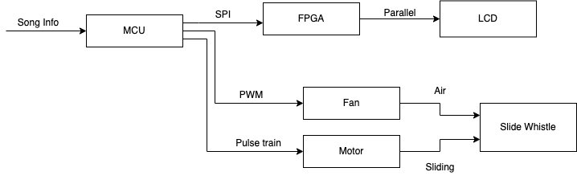

# Project Abstract

In this project, the team aims to create an automated musical instrument. Specifically, a slide whistle will be controlled with a motor, fan and some mounting hardware to be able to play a piece of music on its own. The ultimate goal will be to a system whose only input is an array of notes and durations, and the title of the song. This information will be used to calculate the signals to send to a motor controller and fan. The fan air will be directed into the mouthpiece of the slide whistle and the motor will control a rack and pinion attached to the slide whistle pull rod, thus playing music. The signals controlling the fan and motor will be synchronized so that the slide whistle armature moves, and then the fan blows, to play the correct note for the correct duration. 

# Project Motivation

A slide whistle can be a fun and pleasing instrument to play tunes with, but the tedious process of holding the slide whistle, blowing into it, and moving the rod to the correct position to play the desired notes can quickly become laborious and tiresome. The *Autonomous Intelligent Slide Whistle* removes these inconveniences, providing the user with musical enjoyment at the press of a button.

# System Block Diagram

  

The overall system block diagram is shown above. The microcontroller takes song information (a series of notes) and plays the notes on the slide whistle by controlling a fan system and stepper motor that moves the rod. Meanwhile, it also communicates with the FPGA over a serial peripheral interface, sending the name of the song and the current note being played, for the FPGA to display on the LCD. 
